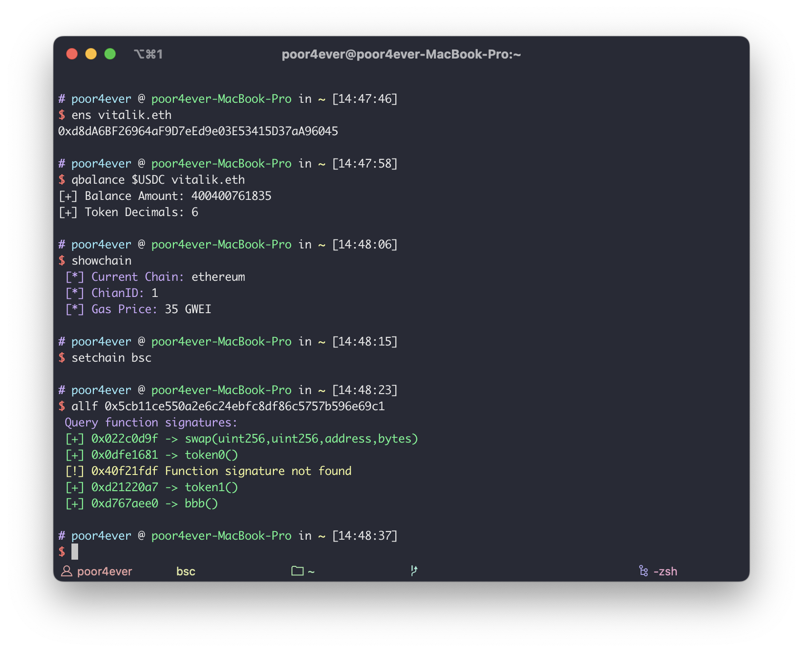

# ChainFuncs

a simple script,simplify some cli operations.

Inspired by: https://gist.github.com/jameswenzel/86d2e1a524ffc66eb424770f74165a49

Modifications and additions based on this script.

## How to use it

1. Modify the blockchain explorer API in basicinfo.sh

2. Append it to `.bashrc` (for Bash shell) or `.zshrc` (for Zsh shell) in the user's home directory.

```bash
echo 'source ~/.myscripts/chain_funcs.sh' >> ~/.zshrc #or .bashrc
source ~/.zshrc #or .bashrc
```

## command list

```bash
# View the available chains
chainlist

# Set the chain
setchain <chai name>

# View chain details
showchain

#Look up the address on the debank(Only available for Mac)
debank <ens or address>

#Look up the address on the blockchain explorer(Only available for Mac)
explore <ens or address or tx>

# Decimal to Hex
d2h

# Hex to Decimal
h2d

# Convert wei into an ETH amount
w2e

#Convert an ETH amount to wei
e2w

# Get token decimals
qdecimals

# Query for the specified address token balance, e.g. `qbalance tokenAddress queryAddress`
qbalance

# Gets the function signature and corresponding function from the not verify contract
allf

# Get the bytecode of a contract
bytecode <contract address>

# Get the selector for a functio, e.g. `fsig "transfer(address, uint256)"`
fsig

#Get the function signatures, e.g. `4byte 0xa9059cbb`
4byte

#Generate a Solidity interface from a given ABI `interface <contract address>`
interface

#...
```

## Example




